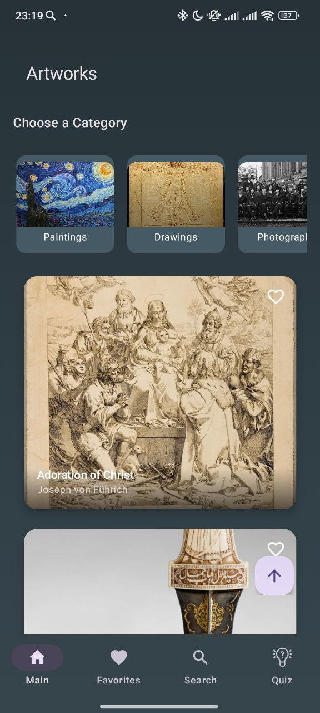
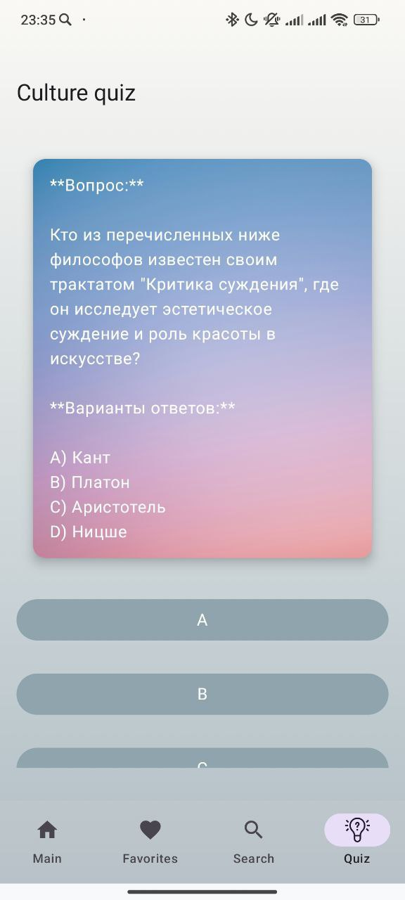
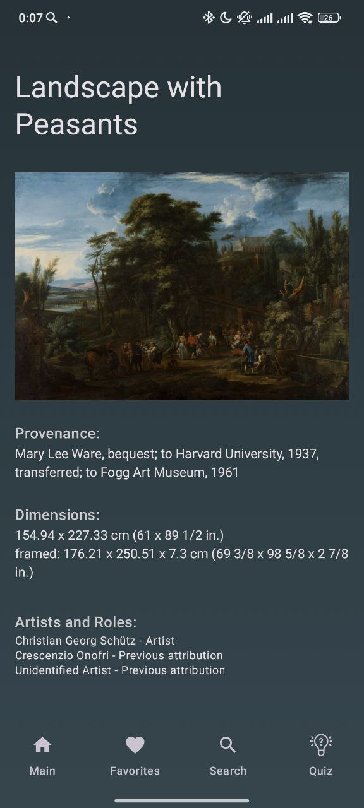

# CulturalWaves

CulturalWaves - это приложение для любителей искусства, которое позволяет пользователям исследовать произведения искусства, добавлять их в избранное и проходить викторины на тему культуры. С помощью CulturalWaves вы можете погрузиться в мир искусства, находить новые произведения и проверять свои знания в интересной форме.

<p align="center">
  
</p>

## Основные возможности
- Бесконечный просмотр произведений искусства путем вертикального скроллинга
  <p align="center">
    
  </p>
- Возможность выбора потока произведений искусства по 12 классификациям
- Добавление произведений в избранное, их удаление оттуда, сортировка по времени добавления (сначала новые/сначала старые)
  <p align="center">
    
  </p>
- Прохождение викторин на тему культуры. Вопросы и ответы с фидбэком генерирует ИИ Gemini
  <p align="center">
    
    
  </p>
  <p align="center">
    Экран викторины в светлой теме.
  </p>
- Поиск произведений искусства по различным критериям, строка с подсказками
  <p align="center">
    
  </p>
- Возможность при клике на карточку с интересующим произведением искусства перейти на отдельный экран с подробным описанием данного произведения, также имеется возможность детального просмотра изображения.
  <p align="center">
    
  </p>


## Цель проекта
CulturalWaves создано для того, чтобы сделать искусство более доступным и увлекательным для широкой аудитории. Приложение подходит как для ценителей искусства, так и для тех, кто только начинает свое знакомство с культурой. Оно помогает пользователям находить новые произведения, узнавать больше о них и проверять свои знания в интерактивной форме.

## Установка и Запуск 

### Требования
- Android Studio 4.1 или новее
- Android SDK 21 или новее
- Установленный Gradle 6.5 или новее

### Инструкции по установке

1. Клонируйте репозиторий:
    ```bash
    git clone https://github.com/Serouce/CulturalWaves.git
    ```
2. Импортируйте проект в Android Studio:
    - Откройте Android Studio.
    - Выберите "File" -> "New" -> "Import Project".
    - Выберите папку с клонированным репозиторием.

3. Синхронизируйте зависимости:
    - Android Studio автоматически предложит синхронизировать проект с Gradle. Если нет, выберите "File" -> "Sync Project with Gradle Files".

4. Запустите приложение:
    - Подключите ваше Android-устройство или запустите эмулятор.
    - Нажмите кнопку "Run" или выберите "Run" -> "Run 'app'" в меню.

Теперь вы готовы использовать приложение CulturalWaves на своем устройстве.

## Использование

После установки и запуска приложения CulturalWaves вы можете воспользоваться следующими функциями:

### Главный экран

На главном экране вы можете просматривать произведения искусства. Листайте вниз для загрузки новых произведений.

### Избранное

На экране избранного вы можете просматривать, добавлять и удалять произведения из вашего списка избранного:
1. Чтобы добавить произведение в избранное, нажмите на иконку сердца на карточке произведения.
2. Чтобы удалить произведение из избранного, нажмите на иконку сердца еще раз.
3. Сортировка: используйте кнопку "Newest First"/"Oldest First" в верхней части экрана для сортировки произведений.

### Поиск

На экране поиска вы можете искать произведения искусства по различным критериям:
1. Введите поисковый запрос в строку поиска.
2. Выберите одно из предложенных произведений или нажмите кнопку поиска для отображения результатов.

### Экран с детальным описанием

На экране с детальным описанием вы можете узнать больше о выбранном произведении искусства и детально рассмотреть его изображения:
1. Нажмите на карточку произведения на любом экране (главном, избранном, поисковом) для перехода к детальному описанию.
2. На экране детального описания вы увидите название произведения, его изображение, описание, технику, происхождение, период и размеры.
3. Для детального просмотра изображения нажмите на него. Изображение откроется в полноэкранном режиме с возможностью увеличения.

### Викторина

На экране викторины вы можете пройти тест на тему культуры:
1. Нажмите кнопку "Новый вопрос" для генерации нового вопроса.
2. Выберите один из вариантов ответа.
3. Получите обратную связь о правильности вашего ответа.

## Технологии

В приложении CulturalWaves использованы следующие технологии и библиотеки:

- **Kotlin** - основной язык программирования.
- **Jetpack Compose** - современный инструментарий для разработки пользовательского интерфейса.
- **Koin** - библиотека для внедрения зависимостей.
- **Retrofit** - библиотека для выполнения сетевых запросов.
- **Paging 3** - библиотека для реализации пагинации.
- **Room** - библиотека для работы с локальной базой данных.
- **Coil** - библиотека для загрузки и отображения изображений.
- **Accompanist** - библиотека для упрощения интеграции с Jetpack Compose, использована для реализации функции SwipeRefresh на главном экране.
- **Harvard Art Museums API** - API, предоставляющий данные о произведениях искусства, использованный в приложении для получения информации о произведениях.
- **Gemini API** - API нейросети, использованный для генерации вопросов и ответов в викторинах.

## Лицензия

Этот проект лицензируется под лицензией MIT. Подробности см. в файле [LICENSE](LICENSE).
